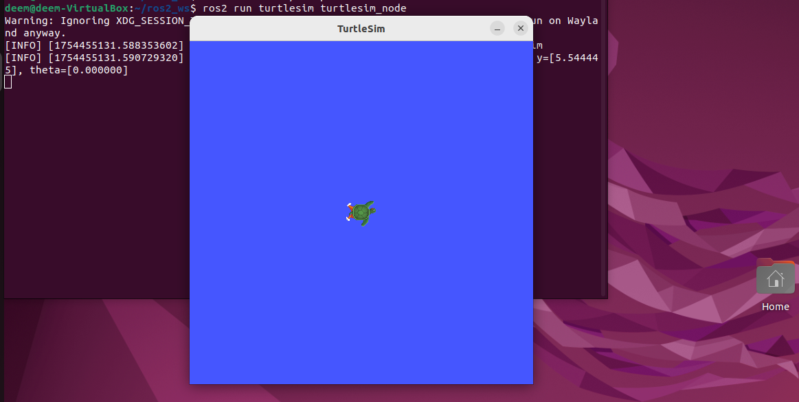
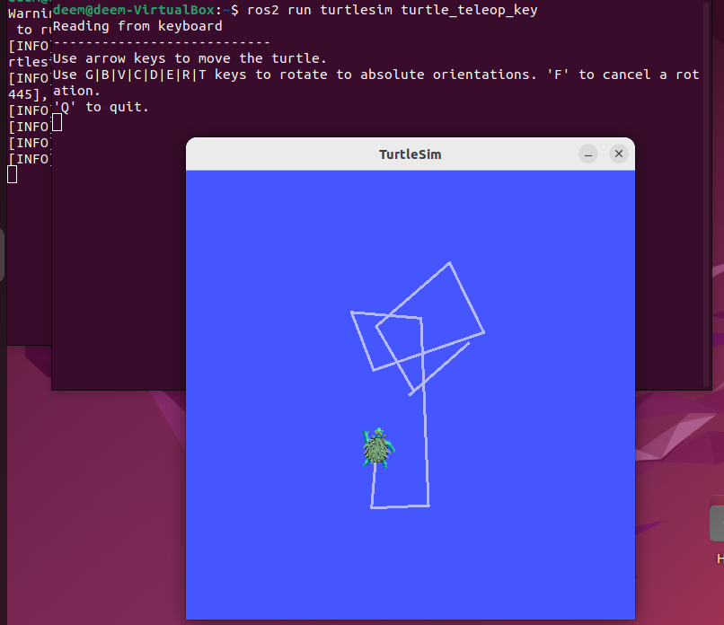
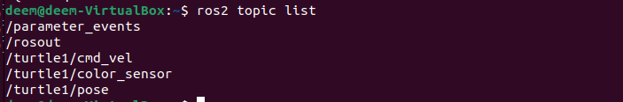
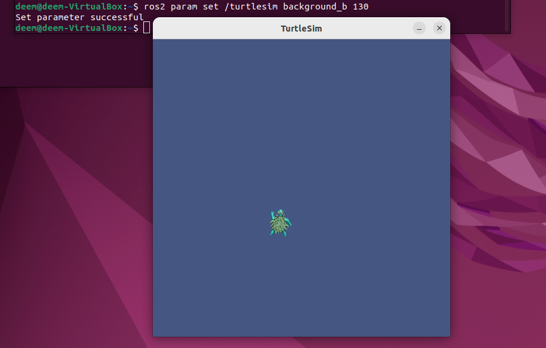

#  ROS2 Turtlesim  Project

This project demonstrates how to use the `turtlesim` package in **ROS2 Humble** to control a turtle using both keyboard and command-line topics. It is built using Ubuntu inside VirtualBox.

---

## Project Objectives

- Launch the turtlesim node
- Move the turtle with keyboard input
- Explore ROS2 topics
- Change background color using parameters
- Move the turtle continuously using command-line publishing
- Capture screenshots and a video of the results

---

## Steps & Results

###  1. Launch turtlesim

```bash
ros2 run turtlesim turtlesim_node
```
This command opens the turtle simulation window.


## 2. Move turtle with keyboard
```bash
ros2 run turtlesim turtle_teleop_key
```
Use arrow keys to move the turtle.


## 3. List active topics
```bash
ros2 topic list
```


## 4.Change background color
```bash
ros2 param set /turtlesim background_b 200
ros2 service call /clear std_srvs/srv/Empty
```


## 5. Move turtle using command-line
Instead of writing Python code, I used a simple command to move the turtle continuously in a circle:
```bash
ros2 topic pub /turtle1/cmd_vel geometry_msgs/msg/Twist "{linear: {x: 2.0}, angular: {z: 1.0}}"
```
[Click to watch the turtle move](videos/circle_move.png)

##  Environment Info
+ Ubuntu (on VirtualBox)

+ ROS2 Humble

+ turtlesim package


